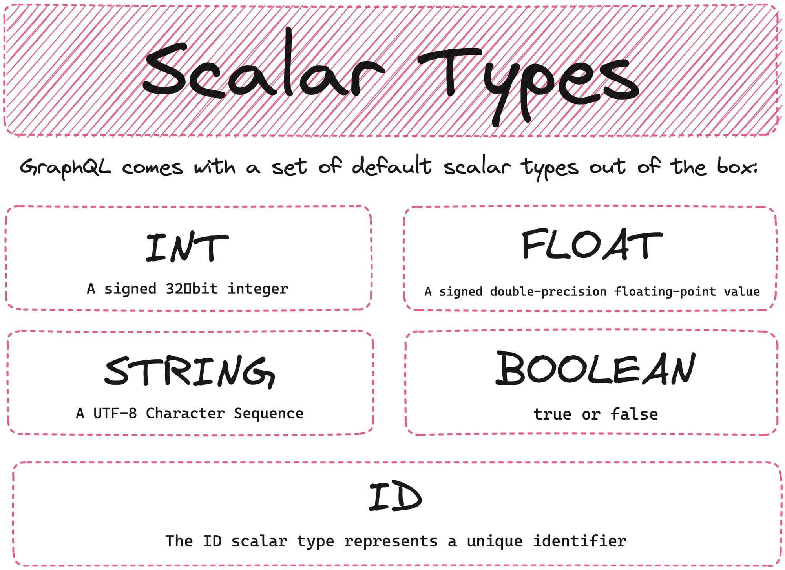

# GraphQL Custom Scalars

In this tutorial we will be discussing scalars in GraphQL - the five scalar types defined in the GraphQL specification, and how you can use custom scalars when needed. 

We'll be creating a brand new Spring Boot 3 project which will include Spring for GraphQL, and then we'll take a look at defining our schema. We'll use the built-in scalars, and then create a custom scalar for things like price and date created. We'll use a Command Line Runner to create a few products, and then use the GraphQL Playground to validate our query. 

Follow along as Dan Vega guides us through creating a GraphQL API with custom scalars!

